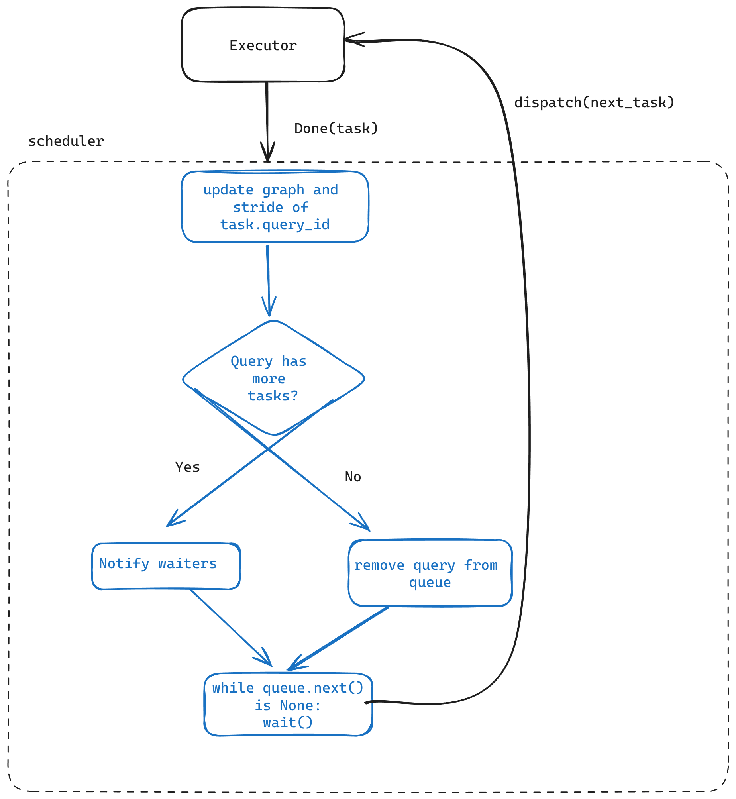

# Scheduler
* Makoto Tomokiyo (mtomokiy)
* Mingkang Li (mingkanl)
* Aidan Smith (adsmith2)

# Overview
**Goal of the Project:** 
- The aim of this project is to develop a Rust-based scheduler for a distributed cloud-native OLAP DBMS on a shared-disk architecture. This scheduler will process Datafusion execution plans, managing and sending Datafusion ExecutionPlans across various execution nodes. Additionally, it will collect and relay the final results back to the user.

- The scheduler should enable concurrent delivery and dispatch of QUERY plans from one or more QUERY optimizers (inter-QUERY parallelism) along with effective decomposition of each individual QUERY (intra-QUERY parallelism). We aim to produce a module with the following high-level criteria:
  - Fair, responsive scheduling policy.
  - Highly concurrent execution and internal data structures for low internal overhead.
  - Modularity, extensibility, extensive documentation, and robust testing infrastructure.

**75% Goals:**
- Able to break down a physical plan into a distributed QUERY plan.
- End-to-end correctness/performance testing framework.
- Provide job status.

**100% Goals:**
- Achieve both inter-QUERY and intra-QUERY parallelism.
- Cost-based and dynamic priority scheduling for better fairness.
- Able to abort/cancel a QUERY.

**125% Goals:**
- Scheduler fault tolerance and scalability.
- Further fragmenting a task into smaller units for work-stealing, which requires data exchange among executors.

# Architectural Design

**Architectural Components:**
- **DAG Parser:** Parses a Datafusion ExecutionPlan into a DAG of stages, where each stage consists of tasks that can be completed without shuffling intermediate results. After decomposing the work, it then enqueues tasks into a work queue in a breadth-first manner.
- **Work Queue:** A concurrent queue where tasks are enqueued by the DAG Parser. Each QUERY submitted by the optimizer also has a cost, allowing for heuristic adjustments to the ordering.
- **Work Threads (tokio):** Tokio threads are created for each executor node to handle communications.
- **QueryID Table:** An in-memory data structure mapping QueryIDs to a DAG of remaining QUERY fragments and cost estimates retrieved from the optimizer.
- **Executors:** Each executor is connected to the scheduler and the other executors via gRPC (tonic).
- **Intermediate Results**: Intermediate results are stored as a thread-safe hashmap in shared memory. All executors will be able to access intermediate results without having to serialize/deserialize data.

**Workflow:**
1. Receives Datafusion ExecutionPlans from Query Optimizer and parses them into DAG, then stores in QueryID Table.
2. Leaves of DAG are added to work queue that work threads can pull from.
3. When execution nodes pull next tasks from the scheduler with an gRPC endpoint, the scheduler provides the task and updates the work queue/Query ID Table.
5. Upon completion of the last leaf, the job is marked as done in the QueryID Table, and results are stored (either to an S3 location or in memory) until the client calls `query_job_status`.

# Design Rationale

- **Throughput:** Achieved by the DAG parser that breaks down a logical plan into a distributed QUERY plan.
- **Query Responsiveness and Fairness:** Minimizing tail latencies by associating each QUERY with a cost (provided by the optimizer) and by softly prioritizing queries with fewer remaining operators in the work queue.
- **Low Overhead:** Adoption of gRPC as the communication protocol among nodes due to its binary encoding and lower serialization/deserialization overhead compared to REST APIs. A push-based mechanism is used to minimize latency.
- **Task Granularity:** Aims to maximize load balancing by finding good task granularities, both within a single operator and between sequences of operators.

# Testing Plan

### Unit Testing
Individual components within the scheduler will be unit tested using Rust’s test module.

## End-to-End Testing Framework Components

The end-to-end testing framework is composed of three primary components: the mock frontend, the mock catalog, and the mock executors.

### 1. Frontend
The `MockFrontend` class is responsible for:
 - Establishing and maintaining a connection with the scheduler.
- Receiving SQL queries and processing them through an optimizer.
- Submitting these physical plans to the scheduler for execution.
- Periodically polling the scheduler for status updates on the submitted queries.
- Storing status updates, results, and other metadata in a local state for retrieval and management.

Key components of the frontend are:
- **SchedulerApiClient**: Communicates with the scheduler to submit tasks and fetch their status.
- **Job Management**: Tracks the progress and results of submitted queries using a hashmap, handling statuses like InProgress, Done, and Failed.

The front end has three modes of operation:
- **Interactive Mode**: Allows users to manually enter SQL queries interactively. This mode is useful for
   ad-hoc testing and debugging, where users can input queries and immediately see results and system behavior.

 - **File Mode**: Executes a series of SQL commands from a specified file. This mode is intended for automated
  testing or regression tests.

- **Benchmark Mode**: Runs the entire set of 22 TPC-H benchmark queries to measure the performance and efficiency
  of the system. This mode is crucial for performance testing and helps in understanding the scalability and
  throughput of the system under heavy loads.

### 1. Mock Optimizer
It uses the default optimizer from Apache Arrow Datafusion.

### 2. Executor Client
The `ExecutorClient` establishes a connection with the scheduler through a handshake message
and continuously handles the cycle of receiving tasks, executing them, and reporting back
the results. The client makes gRPC calls to receive new tasks from the scheduler and
reports the outcomes of executed tasks. Upon receiving a task, it delegates the execution to the `MockExecutor`. The actual execution
logic is encapsulated within the `MockExecutor`, which can be replaced or modified by changing
the implementation in `mock_executor.rs` to fit different execution models or strategies.

### 3. Mock Executors
These consist of DataFusion executors and gRPC clients that execute tasks, receiving instructions from and reporting results back to the scheduler.

### 4. Mock Catalog
- **Config Management**: Parses system configurations from TOML files.
- **Catalog Loading**: Dynamically loads and registers table schemas from `.tbl` files located on the local disk.
  
### Performance Benchmarking
To assess the scheduler's capacity to handle complex OLAP queries and maintain high throughput, we intend to use the integration test framework to simultaneously submit all 22 TPC-H queries across a cluster of executors. We will collect the following metrics:

- **Speedup from Scaling Out Executors**: Measure the speedup gained from increasing the number of executors.
- **Execution Time for Each Query**: Measure the duration from submission to completion for each query.
- **Busy-Idle Time Ratio for Each Executor**: Record periods of activity and inactivity for each executor throughout the test.

Additionally, we plan to develop data visualization tools in Python to present the results more effectively.

## Future Composability with Other Components
The mock optimizer and executor can be directly replaced with alternative implementations without necessitating any additional changes to the system. While the catalog, cache, and storage layers are not directly integrated into the testing system, we plan to encapsulate most of the logic within the mock catalog to simplify future integration.

# Trade-offs and Potential Problems

- **Work Queue:** The work queue may become a bottleneck as all worker threads retrieve data from it. Choosing an ideal scheduling policy could also become a challenge.
- **Memory Footprint of Metadata:** Uncertainty about the potential memory footprint implications of storing extensive metadata alongside the DAGs in the QUERY table.
- **gRPC over REST:** Chosen for better performance. However, modifying messages requires recompiling the proto file, which may introduce complexity during development.
- **Breadth-First vs. Work-First Task Scheduling:** Our scheduler does not yet implement job stealing, and some research shows that work-first scheduling can experience reduced throughput without task migration, especially with imbalanced loads [1]. Furthermore, breadth-first scheduling may work better with push-based assignment. However, work-first scheduling can have significant locality benefits.
- **Scalability:** Our current architecture assumes that it will be deployed as a single component on a single compute node. However, the ability to scale the scheduler microservice can increase throughput, availability, and fault tolerance as the rest of the system scales, though this may increase the complexity of the system.

# Glossary
- **Stage/Task:** refers to a chunk of work that can be completed without shuffling intermediate data. In practice, this consists of an upwards path of physical operators in the QUERY plan DAG that terminates in a pipeline breaker, at the root of the plan, or any intermediary point where the optimizer/scheduler finds fit to demarcate tasks.
- **Depth-first/Breadth-first Scheduling:** When an execution pipeline is split up into multiple components, the scheduler can choose to dispatch tasks further up the pipeline of recently completed stages, or dispatch all tasks that are furthest in the QUERY plan DAG first.

- [1]. Duran, Alejandro et al. Evaluation of OpenMP Task Scheduling Strategies. https://link.springer.com/chapter/10.1007/978-3-540-79561-2_9

