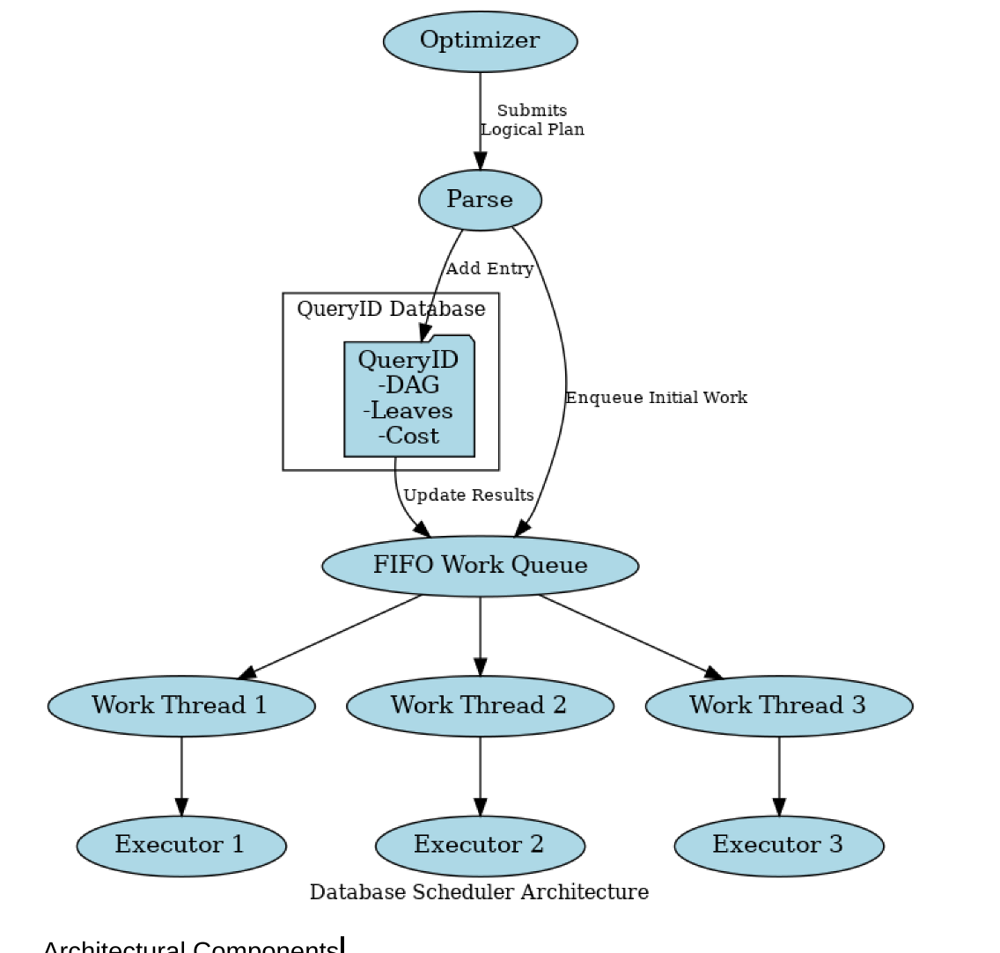

# Scheduler
* Makoto Tomokiyo (mtomokiy)
* Mingkang Li (mingkanl)
* Aidan Smith (adsmith2)

# Overview
**Goal of the Project:** 
- The aim of this project is to develop a Rust-based scheduler for a distributed cloud-native OLAP DBMS on a shared-disk architecture. This scheduler will process Substrait physical plans, managing and sending Substrait physical plans across various execution nodes. Additionally, it will collect and relay the final results back to the user.

- The scheduler should enable concurrent delivery and dispatch of query plans from one or more query optimizers (inter-query parallelism) along with effective decomposition of each individual query (intra-query parallelism). We aim to produce a module with the following high-level criteria:
  - Fair, responsive scheduling policy.
  - Highly concurrent execution and internal data structures for low internal overhead.
  - Modularity, extensibility, extensive documentation, and robust testing infrastructure.

**75% Goals:**
- Able to break down a physical plan into a distributed query plan.
- Achieve both inter-query and intra-query parallelism.
- Provide job status.
- End-to-end correctness/performance testing framework.

**100% Goals:**
- Implement data shuffling between query stages.
- Cost-based and dynamic priority scheduling for better fairness.
- Data-locality optimizations.
- Able to abort/cancel a query.

**125% Goals:**
- Scheduler fault tolerance and scalability.
- Further fragmenting a task into smaller units for work-stealing, which requires data exchange among executors.

# Architectural Design

**Architectural Components:**
- **DAG Parser:** Parses a Substrait logical plan into a DAG of stages, where each stage consists of tasks that can be completed without shuffling intermediate results. After decomposing the work, it then enqueues tasks into a work queue in a breadth-first manner.
- **Work Queue:** A concurrent queue (initially FIFO) where tasks are enqueued by the DAG Parser. Each query submitted by the optimizer also has a cost, allowing for heuristic adjustments to the ordering.
- **Work Threads (tokio):** Tokio threads are created for each executor node to handle communications.
- **QueryID Table:** An in-memory data structure mapping QueryIDs to a DAG of remaining query fragments and cost estimates retrieved from the optimizer.
- **Executors:** Each executor is connected to the scheduler and the other executors via gRPC (tonic).

**Workflow:**
1. Receives Substrait Logical Plans from Query Optimizer and parses them into DAG, then stores in QueryID Table.
2. Leaves of DAG are added to work queue that work threads can pull from.
3. Work threads pull work from the queue and push to execution nodes, then update QueryID Table with results, and enqueue any new leaves.
4. Upon completion of the last leaf, the job is marked as done in the QueryID Table, and results are stored (either to an S3 location or in memory) until the client calls `query_job_status`.

# Design Rationale

- **Throughput:** Achieved by the DAG parser that breaks down a logical plan into a distributed query plan.
- **Query Responsiveness and Fairness:** Minimizing tail latencies by associating each query with a cost (provided by the optimizer) and by softly prioritizing queries with fewer remaining operators in the work queue.
- **Low Overhead:** Adoption of gRPC as the communication protocol among nodes due to its binary encoding and lower serialization/deserialization overhead compared to REST APIs. A push-based mechanism is used to minimize latency.
- **Task Granularity:** Aims to maximize load balancing by finding good task granularities, both within a single operator and between sequences of operators.

# Testing Plan

### Unit Testing
Individual components within the scheduler will be unit tested using Rust’s test module.

### End-to-End / Integration Testing
To test the correctness of our scheduler implementation, we intend on using Apache DataFusion as an executor, and comparing the Arrow results from running our scheduler on a given Substrait plan, against the naive result. We will use the same pipeline to benchmark the performance of our scheduler, measuring the time to compute the final Arrow results, again using DataFusion as our executor. We can use EC2 to simulate multiple executors for more precise performance metrics.

### CI/CD
We aim to build a pipeline with GitHub Actions that will allow us to continuously run our end-to-end correctness tests before merging PRs to establish a correct implementation early, and maintain that as we add more advanced functionality to our scheduler.

# Trade-offs and Potential Problems

- **Work Queue:** The work queue may become a bottleneck as all worker threads retrieve data from it. Choosing an ideal scheduling policy could also become a challenge.
- **Memory Footprint of Metadata:** Uncertainty about the potential memory footprint implications of storing extensive metadata alongside the DAGs in the query table.
- **gRPC over REST:** Chosen for better performance. However, modifying messages requires recompiling the proto file, which may introduce complexity during development.
- **Breadth-First vs. Work-First Task Scheduling:** Our scheduler does not yet implement job stealing, and some research shows that work-first scheduling can experience reduced throughput without task migration, especially with imbalanced loads [1]. Furthermore, breadth-first scheduling may work better with push-based assignment. However, work-first scheduling can have significant locality benefits.
- **Scalability:** Our current architecture assumes that it will be deployed as a single component on a single compute node. However, the ability to scale the scheduler microservice can increase throughput, availability, and fault tolerance as the rest of the system scales, though this may increase the complexity of the system.

# Glossary
- **Stage/Task:** refers to a chunk of work that can be completed without shuffling intermediate data. In practice, this consists of an upwards path of physical operators in the query plan DAG that terminates in a pipeline breaker, at the root of the plan, or any intermediary point where the optimizer/scheduler finds fit to demarcate tasks.
- **Depth-first/Breadth-first Scheduling:** When an execution pipeline is split up into multiple components, the scheduler can choose to dispatch tasks further up the pipeline of recently completed stages, or dispatch all tasks that are furthest in the query plan DAG first.

- [1]. Duran, Alejandro et al. Evaluation of OpenMP Task Scheduling Strategies. https://link.springer.com/chapter/10.1007/978-3-540-79561-2_9

